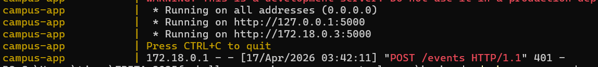
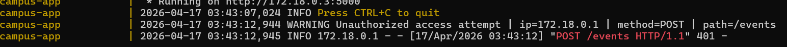

# C029 — Structured Logging + Alerting

**Files:** `backend/src/extension.py`, `backend/src/routes.py`

---

## Problem — No audit trail

The original application had zero logging. Every action — event
creation, registration deletion, failed authentication — left no
record. An attacker could:

- Attempt thousands of API key guesses with no trace
- Delete all registrations and disappear
- Create fake events and remove them — no forensic record

Without logs there is no way to detect an attack in progress,
investigate after an incident, or prove what happened.

---

## Fix — Structured logging

Added a logger to `extension.py` so both `routes.py` and future
modules can share the same logger instance:

```python
# extension.py
import logging

logging.basicConfig(
    level=logging.INFO,
    format="%(asctime)s %(levelname)s %(message)s"
)
logger = logging.getLogger(__name__)
```

Imported in `routes.py`:
```python
from extension import logger
```

---

## What gets logged

### Auth failures — WARNING level

Every request with a missing or wrong API key is logged with the
caller's IP, HTTP method, and path:

```python
def require_api_key(f):
    @wraps(f)
    def decorated(*args, **kwargs):
        key = request.headers.get("X-API-Key", "")
        if key != os.environ.get("ADMIN_API_KEY"):
            logger.warning(
                f"Unauthorized access attempt | "
                f"ip={request.remote_addr} | "
                f"method={request.method} | "
                f"path={request.path}"
            )
            return jsonify({"error": "Unauthorized"}), 401
```

**Why WARNING level:** Auth failures are suspicious by nature.
A single failure might be a developer mistake. A hundred failures
from the same IP in one minute is an automated attack. WARNING
level makes these easy to filter and alert on separately from
normal INFO traffic.

### Event creation — INFO level

```python
event = create_event(conn, data)
logger.info(
    f"Event created | "
    f"ip={request.remote_addr} | "
    f"id={event['id']} | "
    f"title={event['title']}"
)
```

**Why:** Creates a timeline of every event added. If fake events
appear, logs show which IP created them and when.

### Registration creation — INFO level

```python
result = registration_create(conn, event_id, data)
logger.info(
    f"Registration created | "
    f"ip={request.remote_addr} | "
    f"event_id={event_id} | "
    f"user={data['user_name']} | "
    f"email={data['email']}"
)
```

**Why:** PII is being stored. Logging who registered from which IP
creates an audit trail for GDPR compliance and abuse investigation.

### Registration deletion — INFO level

```python
logger.info(
    f"Registration deleted | "
    f"ip={request.remote_addr} | "
    f"event_id={event_id} | "
    f"reg_id={reg_id}"
)
```

**Why:** Deletion is irreversible. If registrations are wiped,
logs show exactly which IP deleted which records and when — the
only forensic evidence available after the fact.

---

## Before vs after — evidence

**Before** — Docker logs showed only raw HTTP access lines with no
context:



**After** — Docker logs now show structured security events:


The WARNING line identifies the event type, the attacker's IP,
the method, and the targeted path — everything needed to investigate
or block the caller.

---

## Log format

```
%(asctime)s  %(levelname)s  %(message)s
     ↑             ↑              ↑
  timestamp      WARNING      structured key=value pairs
               or INFO
```

Key-value format (`ip=x | method=y | path=z`) makes logs easy to
parse programmatically — tools like Splunk, Datadog, or simple
`grep` can filter by any field instantly.

---
